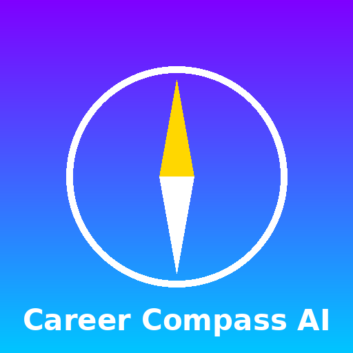
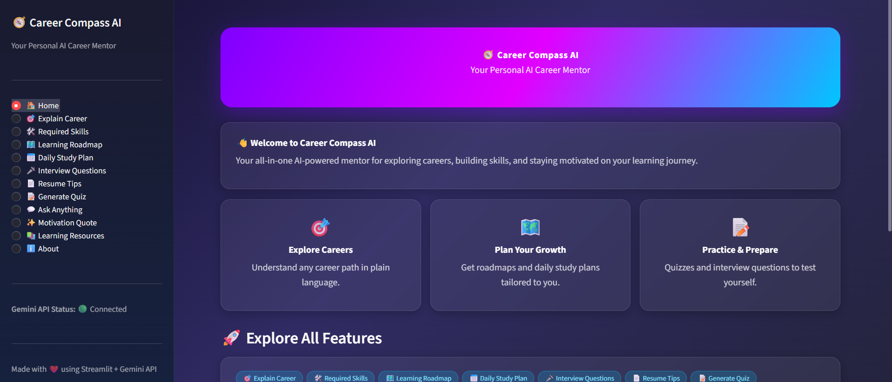
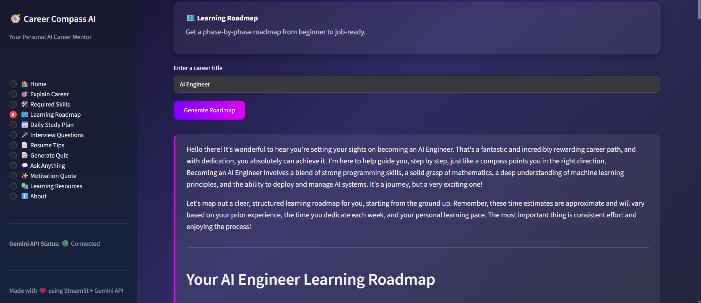
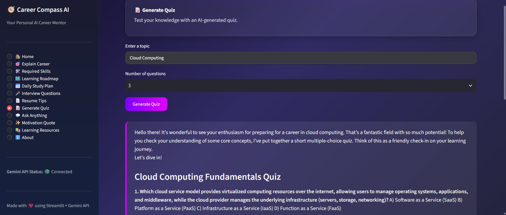

# 🧭 Career Compass AI

### *Your Personal AI Career Mentor*

Career Compass AI is a professional, AI-powered **Learning Buddy** built with
**Streamlit** and the **Google Gemini API**. It acts as a friendly career
mentor — helping students and early-career professionals explore careers,
build learning roadmaps, prepare for interviews, and stay motivated, all
through a modern, gradient-styled dashboard interface.



---

## 📋 Table of Contents

- [Project Overview](#-project-overview)
- [Features](#-features)
- [Tech Stack](#-tech-stack)
- [Requirements](#-requirements)
- [How to Get a Gemini API Key](#-how-to-get-a-gemini-api-key)
- [Installation](#-installation)
- [How to Run Locally](#-how-to-run-locally)
- [Deployment on Streamlit Cloud](#-deployment-on-streamlit-cloud)
- [Folder Structure](#-folder-structure)
- [Screenshots](#-screenshots)
- [Documentation Files](#-documentation-files)
- [Future Improvements](#-future-improvements)
- [License](#-license)

---

## 🎯 Project Overview

Career Compass AI was built to demonstrate a complete, submission-ready AI
learning application: a polished frontend, a well-structured backend, a
consistent AI persona, and thoughtful prompt engineering — all wrapped in a
professional, portfolio-worthy UI.

The app uses **Google Gemini** to power ten distinct career-guidance
features, each with its own purpose-built prompt template, so the AI's
responses stay focused, structured, and genuinely useful rather than vague
or generic.

---

## ✨ Features

| # | Feature | Description |
|---|---|---|
| 1 | 🎯 **Explain Career** | Get a clear, beginner-friendly explanation of any career path. |
| 2 | 🛠️ **Required Skills** | See the technical and soft skills needed for a career. |
| 3 | 🗺️ **Learning Roadmap** | Get a phase-by-phase roadmap from beginner to job-ready. |
| 4 | 📅 **Daily Study Plan** | Generate a realistic weekly study plan based on your available hours. |
| 5 | 🎤 **Interview Questions** | Practice with common interview questions for your experience level. |
| 6 | 📄 **Resume Tips** | Get tailored resume-writing advice and ATS optimization tips. |
| 7 | 📝 **Generate Quiz** | Test your knowledge with an AI-generated multiple-choice quiz. |
| 8 | 💬 **Ask Anything** | Ask your AI mentor any career or learning-related question. |
| 9 | ✨ **Motivation Quote** | Get an instant, mood-based motivational boost. |
| 10 | 📚 **Learning Resources** | Get curated courses, books, YouTube channels, and communities. |

**Plus:** Sidebar navigation, icons & emojis throughout, a professional
footer, an About section, loading spinners, robust error handling, and
input validation on every form.

---

## 🧰 Tech Stack

**Frontend**
- [Streamlit](https://streamlit.io/) — Python web app framework
- Custom CSS — gradients, cards, responsive layout
- Modern dashboard-style UI

**Backend**
- Python 3.9+
- [Google Gemini API](https://ai.google.dev/) via `google-generativeai` SDK
- `python-dotenv` for environment variable management

---

## ✅ Requirements

- Python **3.9 or higher**
- A free **Google Gemini API key**
- pip (Python package manager)
- Internet connection (to reach the Gemini API)

All Python dependencies are listed in [`requirements.txt`](requirements.txt):

```
streamlit>=1.32.0
google-generativeai>=0.5.0
python-dotenv>=1.0.1
```

---

## 🔑 How to Get a Gemini API Key

1. Go to [Google AI Studio](https://aistudio.google.com/app/apikey).
2. Sign in with your Google account.
3. Click **"Create API Key"**.
4. Copy the generated key.
5. Paste it into your `.env` file as shown in the [Installation](#-installation)
   section below.

> 💡 Gemini offers a generous free tier, which is more than enough for
> running and testing this app.

---

## ⚙️ Installation

1. **Clone or extract the project**

   ```bash
   git clone <your-repo-url>
   cd CareerCompassAI
   ```

2. **Create a virtual environment (recommended)**

   ```bash
   python -m venv venv

   # Activate it:
   # Windows:
   venv\Scripts\activate
   # macOS/Linux:
   source venv/bin/activate
   ```

3. **Install dependencies**

   ```bash
   pip install -r requirements.txt
   ```

4. **Set up your environment variables**

   ```bash
   cp .env.example .env
   ```

   Then open `.env` and add your Gemini API key:

   ```
   GEMINI_API_KEY=your_actual_api_key_here
   ```

---

## ▶️ How to Run Locally

Once installed and configured, run:

```bash
streamlit run app.py
```

Streamlit will start a local server and automatically open the app in your
browser at:

```
http://localhost:8501
```

If the API key is missing or invalid, the app will still run and display a
clear warning message instead of crashing — you'll see a 🔴 status indicator
in the sidebar.

---

## ☁️ Deployment on Streamlit Cloud

1. Push this project to a **GitHub repository**.
2. Go to [Streamlit Community Cloud](https://streamlit.io/cloud) and sign in.
3. Click **"New app"** and select your repository, branch, and `app.py` as
   the entry point.
4. Under **"Advanced settings" → "Secrets"**, add your API key in TOML format:

   ```toml
   GEMINI_API_KEY = "your_actual_api_key_here"
   ```

5. Click **"Deploy"**. Streamlit Cloud will install dependencies from
   `requirements.txt` automatically and launch your app with a public URL.

> 🔒 **Never commit your real `.env` file or API key to GitHub.** The
> `.gitignore` file in this project already excludes `.env` by default.

---

## 📁 Folder Structure

```
CareerCompassAI/
│
├── app.py                     # Main Streamlit application
├── requirements.txt           # Python dependencies
├── README.md                  # Project documentation (this file)
├── .env.example                # Example environment variable file
├── .gitignore                  # Git ignore rules
├── LICENSE                     # MIT License
│
├── assets/
│   └── logo.png                # App logo / placeholder branding image
│
├── persona.md                  # AI mentor persona definition
├── prompts.md                  # 5 reusable prompt templates
├── quiz.md                     # Sample quiz with answers
├── reflection.md                # Project reflection (strengths/limitations/improvements)
├── sample_conversation.md       # Realistic student-AI conversation
├── screenshots_guide.md         # Guide for required submission screenshots
└── submission_report.md         # Final submission report
```

---

## 🖼️ Screenshots

> See [`screenshots_guide.md`](screenshots_guide.md) for the full list of
> recommended screenshots to capture. Once captured, place them in a
> `screenshots/` folder and reference them below:

```markdown



```

---

## 📚 Documentation Files

| File | Purpose |
|---|---|
| `persona.md` | Defines the AI mentor's personality and tone |
| `prompts.md` | 5 reusable, parameterized prompt templates |
| `quiz.md` | A full sample quiz with correct answers |
| `sample_conversation.md` | A realistic end-to-end student-AI conversation |
| `reflection.md` | 300–400 word reflection on the project |
| `screenshots_guide.md` | Exact screenshots needed for submission |
| `submission_report.md` | Final markdown submission report |

---

## 🚀 Future Improvements

- 👤 User accounts with saved roadmaps and progress tracking
- 🧠 Persistent chat memory for more natural, ongoing mentorship
- 📄 Export roadmaps, study plans, and resumes as downloadable PDFs
- 🔊 Voice input and text-to-speech output
- 📊 Integration with live job market/salary data APIs
- 🌐 Multi-language support

---

## 📄 License

This project is licensed under the **MIT License** — see [`LICENSE`](LICENSE)
for details.

---

<p align="center">
🧭 <b>Career Compass AI</b> — Your Personal AI Career Mentor<br>
Built with Streamlit &amp; Google Gemini API
</p>
