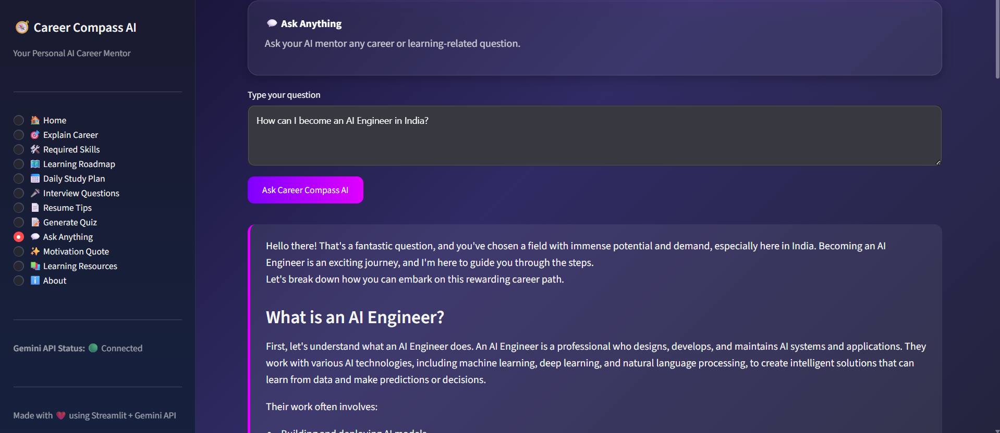

# 🧭 Career Compass AI

<p align="center">

### **Your Personal AI Career Mentor**

An AI-powered career guidance platform built with **Streamlit** and **Google Gemini API** to help students explore careers, build personalized learning roadmaps, prepare for interviews, improve resumes, and stay motivated throughout their learning journey.

</p>

---

## 🌟 Project Highlights

- 🤖 AI-Powered Career Mentor
- 🎯 Beginner-Friendly Career Explanations
- 🛠 Personalized Skill Recommendations
- 🗺 Step-by-Step Learning Roadmaps
- 📅 Daily Study Planner
- 🎤 AI-Generated Interview Questions
- 📄 Resume Improvement Tips
- 📝 Interactive Quiz Generator
- 💬 Ask Anything Career Assistant
- 📚 Learning Resources Recommendations
- ✨ Motivation Quotes
- 🎨 Modern Responsive Streamlit UI

---

## 📸 Preview


| Home | Roadmap |
|------|----------|
|  |  |

| Quiz | Ask Anything |
|------|---------------|
|  |  |

---

# 📖 Project Overview

Career Compass AI is an intelligent AI Learning Buddy designed to guide students in choosing and preparing for their dream careers.

Unlike traditional career guidance systems, Career Compass AI provides personalized AI-generated responses using **Google Gemini**, allowing users to:

- Understand different career paths
- Learn required technical & soft skills
- Build personalized study plans
- Prepare for interviews
- Improve resumes
- Practice quizzes
- Ask career-related questions
- Stay motivated

The project combines **Artificial Intelligence**, **Prompt Engineering**, and **Modern UI Design** into one complete application.

---

# ✨ Features

| Feature | Description |
|----------|-------------|
| 🎯 Explain Career | Understand any career in simple language |
| 🛠 Required Skills | Learn technical and soft skills |
| 🗺 Learning Roadmap | Complete roadmap from beginner to expert |
| 📅 Daily Study Plan | Personalized study schedule |
| 🎤 Interview Questions | AI-generated interview preparation |
| 💼 Resume Tips | ATS-friendly resume suggestions |
| 📝 Generate Quiz | Multiple-choice quiz with answers |
| 💬 Ask Anything | Free-form AI career assistant |
| ✨ Motivation | Mood-based motivational quotes |
| 📚 Learning Resources | Books, YouTube, Courses & Communities |

---

# 🛠 Tech Stack

### Frontend

- Streamlit
- Custom CSS
- Responsive UI
- HTML/CSS Components

### Backend

- Python
- Google Gemini API
- python-dotenv

---

# 📂 Project Structure

```text
CareerCompassAI/
│
├── app.py
├── requirements.txt
├── README.md
├── .env.example
├── .gitignore
├── LICENSE
│
├── assets/
│   └── logo.png
│
├── screenshots/
│   ├── 01_home.png
│   ├── 02_sidebar.png
│   ├── 03_explain_career.png
│   ├── 04_learning_roadmap.png
│   ├── 05_daily_study_plan.png
│   ├── 06_interview_questions.png
│   ├── 07_generate_quiz.png
│   ├── 08_ask_anything.png
│   ├── 09_motivation_quote.png
│   ├── 10_loading_spinner.png
│   ├── 11_error_handling.png
│   └── 12_about.png
│
├── persona.md
├── prompts.md
├── quiz.md
├── reflection.md
├── sample_conversation.md
├── screenshots_guide.md
└── submission_report.md
```

---

# ⚙ Requirements

- Python 3.10+
- Streamlit
- Google Gemini API Key
- Internet Connection

---

# 📦 Installation

Clone the repository

```bash
git clone https://github.com/ddikshamitraa/CareerCompass-AI.git
```

Go inside project

```bash
cd CareerCompassAI
```

Create Virtual Environment

```bash
python -m venv venv
```

Activate

### Windows

```bash
venv\Scripts\activate
```

### Linux / macOS

```bash
source venv/bin/activate
```

Install Dependencies

```bash
pip install -r requirements.txt
```

---

# 🔑 Configure Gemini API

Rename

```text
.env.example
```

to

```text
.env
```

Then add your Gemini API Key

```text
GEMINI_API_KEY=YOUR_API_KEY_HERE
```

You can get your free API key from:

https://aistudio.google.com/app/apikey

---

# ▶ Run the Application

```bash
streamlit run app.py
```

Open

```
http://localhost:8501
```

---

# ☁ Deploy on Streamlit Cloud

1. Push project to GitHub
2. Open Streamlit Community Cloud
3. Create New App
4. Select Repository
5. Select `app.py`
6. Add Secret

```toml
GEMINI_API_KEY="YOUR_API_KEY"
```

7. Click Deploy

---

# 📚 Documentation

| File | Description |
|------|-------------|
| persona.md | AI Buddy Persona |
| prompts.md | Prompt Templates |
| quiz.md | Sample Quiz |
| reflection.md | Reflection |
| sample_conversation.md | Sample Conversation |
| screenshots_guide.md | Screenshot Guide |
| submission_report.md | Final Report |

---

# 📈 Future Improvements

- 👤 User Authentication
- 📊 Learning Progress Dashboard
- 💾 Save Career Roadmaps
- 📄 Export Roadmaps as PDF
- 🎙 Voice Assistant
- 🔊 Text-to-Speech
- 🤖 Resume Analyzer
- 📈 Skill Progress Tracker
- 🌐 Multi-language Support
- 📱 Mobile Responsive Layout

---

# 🤝 Contributing

Contributions, suggestions and feature requests are always welcome.

Feel free to fork this repository and submit a pull request.

---

# 📄 License

This project is licensed under the **MIT License**.

See the **LICENSE** file for details.

---

# 👩‍💻 Developer

## Diksha Mitra

Computer Science Engineering Student

GitHub:
https://github.com/ddikshamitraa25

---

<p align="center">

### 🧭 Career Compass AI

**Your Personal AI Career Mentor**

Built with ❤️ using **Streamlit** & **Google Gemini API**

© 2026 Diksha Mitra

</p>
